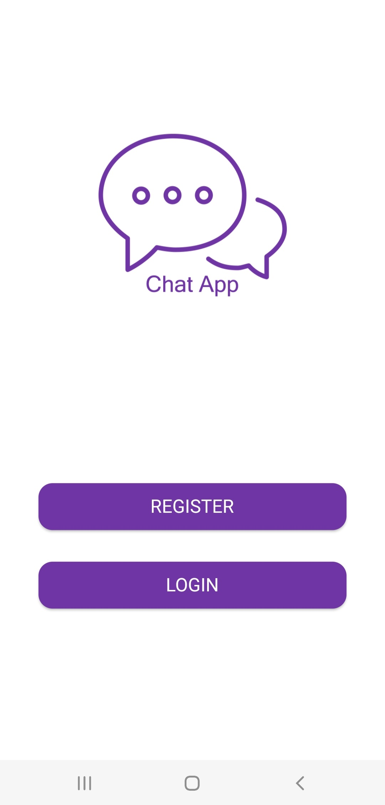
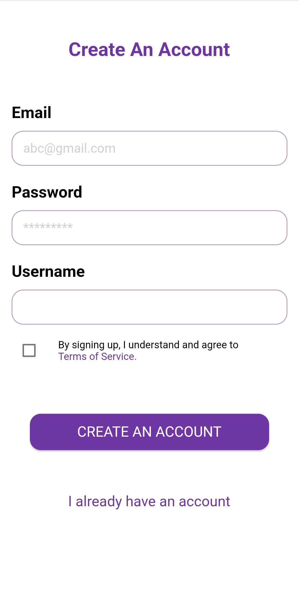
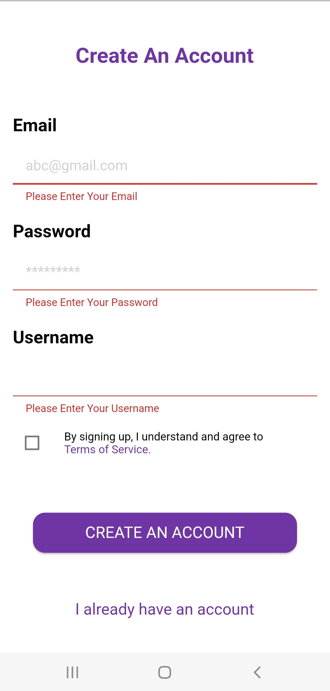
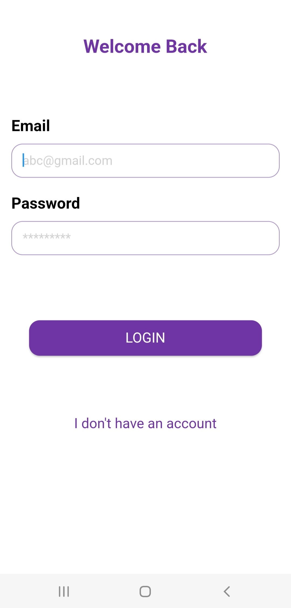
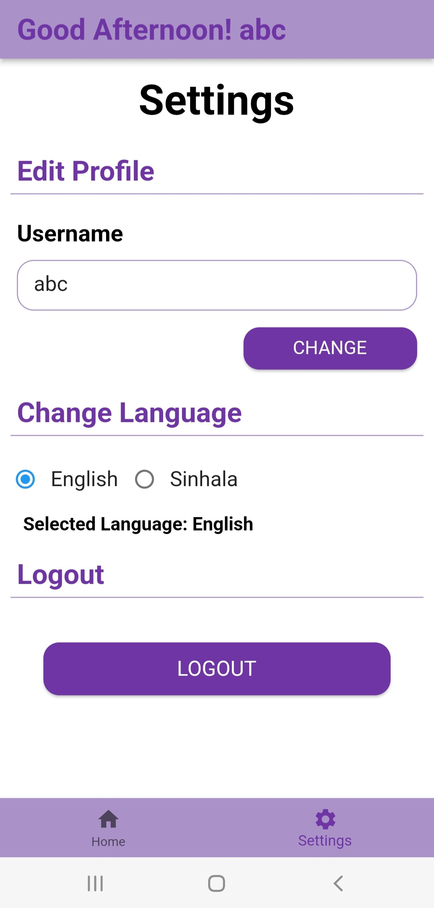
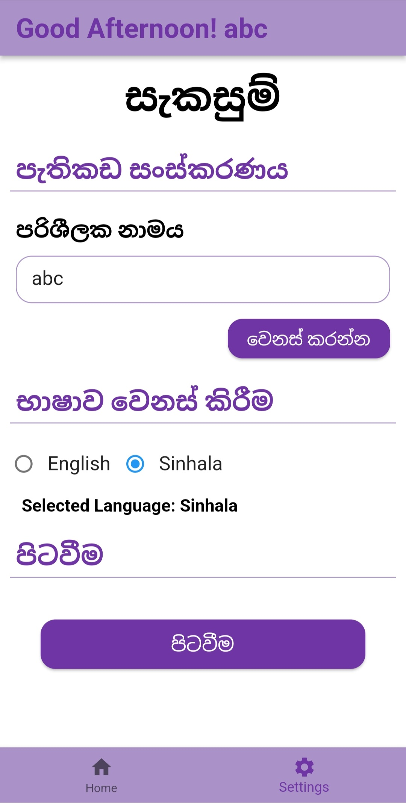
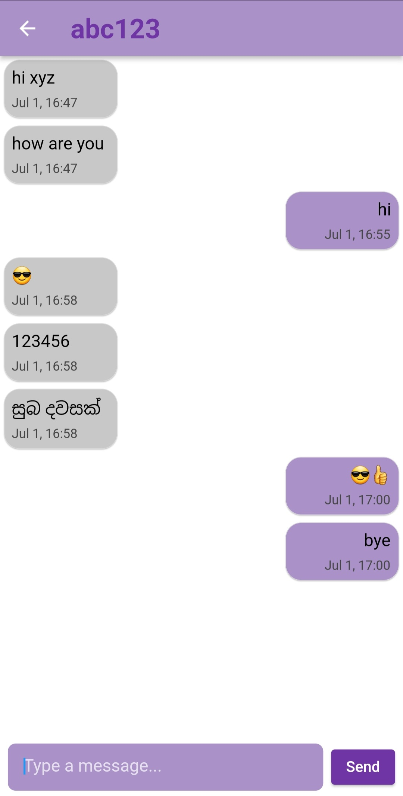
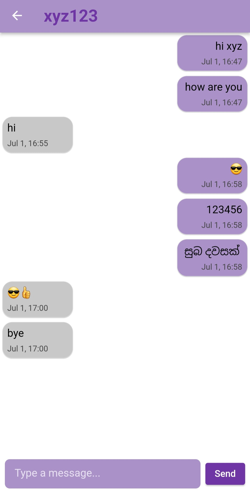

# SimpleChatApp

A simple offline chat app built with Flutter and Sqflite, allowing chat between multiple user accounts within the same phone. The app also supports localization, allowing users to switch between Sinhala and English on the settings page.

## Features

- Offline chat between multiple user accounts on the same device
- Localization support for Sinhala and English
- User-friendly interface

## Screenshots

<table>
  <tr>
    <td></td>
    <td></td>
    <td></td>
    <td></td>
  </tr>
  <tr>
    <td></td>
    <td></td>
    <td></td>
    <td></td>
  </tr>
</table>

## Packages Used

- [flutter](https://pub.dev/packages/flutter)
- [sqflite](https://pub.dev/packages/sqflite)
- [path_provider](https://pub.dev/packages/path_provider)
- [intl](https://pub.dev/packages/intl)

## Getting Started

To get started with the project, follow these steps:

1. Clone the repository:
    ```sh
    git clone https://github.com/AminduBhashana/SimpleChatApp.git
    ```
2. Navigate to the project directory:
    ```sh
    cd SimpleChatApp
    ```
3. Install the dependencies:
    ```sh
    flutter pub get
    ```
4. Run the app:
    ```sh
    flutter run
    ```

## Localization

The app supports two languages: Sinhala and English. You can switch between these languages from the settings page.


